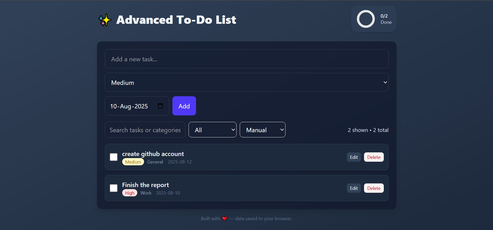

# ✨ Advanced To-Do List App

A modern, responsive, and feature-rich To-Do List application built with **React + Vite** and styled using **Tailwind CSS**.  
It supports task priorities, completion tracking, local storage persistence, and a clean, elegant UI.

---

## 🚀 Features

- **Add, complete, and delete tasks** easily.
- **Priority selection**: High, Medium, Low.
- **Local storage support**: Your tasks stay even after page refresh.
- **Responsive design** for desktop and mobile.
- **Date tracking** for when tasks are created.
- Minimal, modern UI using TailwindCSS.

---

## 📸 Preview

---

## Live Demo
[View Live](https://advance-to-do-khaki.vercel.app/)
